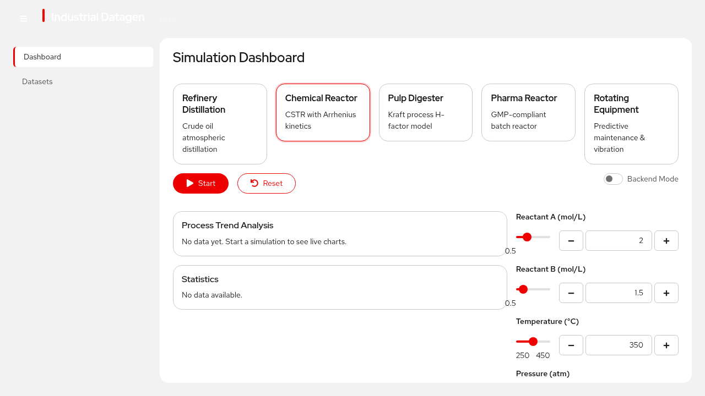
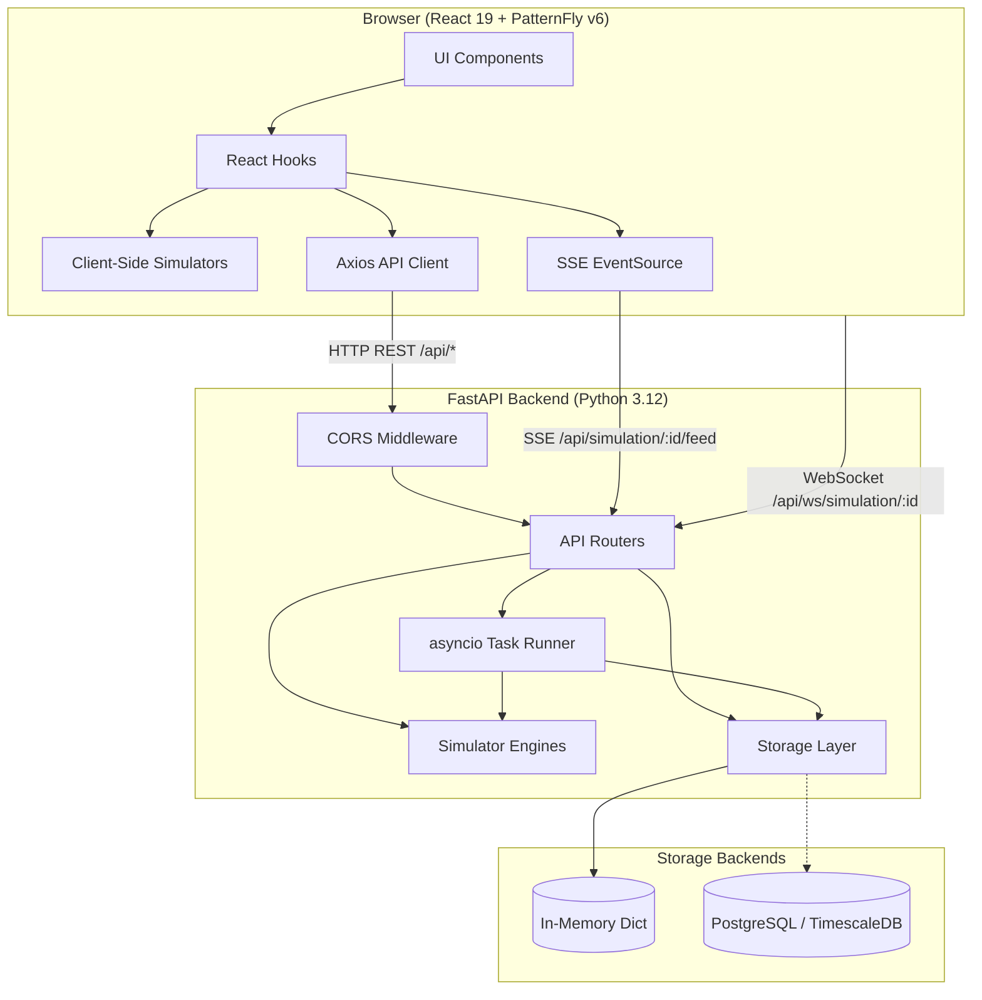
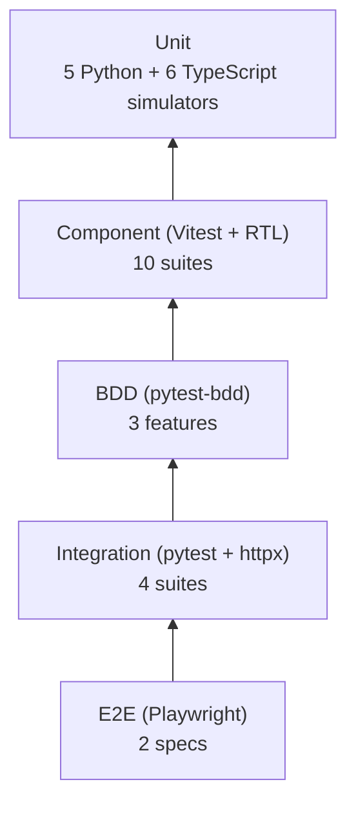

# Industrial Datagen

Industrial process simulation platform for generating realistic AI/ML training datasets. Runs five physics-based simulators in real time, streams live telemetry, and exports bulk labeled datasets with anomaly tagging.

Built with FastAPI, React 19, PatternFly v6, and TypeScript.



## Features

- **5 physics-based simulators** — refinery distillation, CSTR chemical reactor, Kraft pulp digester, pharmaceutical GMP batch reactor, and rotating equipment with predictive maintenance
- **Dual execution mode** — run simulations locally in the browser (TypeScript) or on the server (Python) with persistent storage
- **Real-time streaming** — live data via Server-Sent Events or WebSocket
- **Bulk dataset generation** — export CSV/JSON datasets up to 100k samples with labeled anomalies (~5% rate) for supervised ML
- **Fault injection** — inject bearing faults, rotor imbalance, and misalignment into rotating equipment simulations
- **PatternFly v6 UI** — Red Hat branded dashboard with live charts, parameter sliders, and statistics

## Architecture



See [docs/ARCHITECTURE.md](docs/ARCHITECTURE.md) for the full design, including data flow, request lifecycle sequence diagrams, and the storage abstraction.

## Quick Start

### Prerequisites

- Python 3.12+
- Node.js 22+
- [pnpm](https://pnpm.io/)
- [uv](https://docs.astral.sh/uv/)

### Backend

```bash
cd backend
uv sync --extra test --extra dev
```

### Frontend

```bash
cd frontend
pnpm install
```

### Run

```bash
# Terminal 1 — backend on :8000
make dev-backend

# Terminal 2 — frontend on :5173 (proxies /api to backend)
make dev-frontend
```

Open [http://localhost:5173](http://localhost:5173).

### Docker Compose

```bash
# Production
docker compose -f deploy/docker-compose.yml up app

# Development (hot reload)
docker compose -f deploy/docker-compose.yml --profile dev up

# With PostgreSQL
docker compose -f deploy/docker-compose.yml --profile db up app postgres
```

See [docs/DEPLOYMENT.md](docs/DEPLOYMENT.md) for container builds, OpenShift manifests, and bootc image instructions.

## Simulators

| Simulator | Process | Parameters | Output Fields | Source |
|-----------|---------|:----------:|:-------------:|--------|
| Refinery | Crude oil atmospheric distillation | 4 | 17 | [`backend/app/simulators/refinery.py`](backend/app/simulators/refinery.py) |
| Chemical | CSTR continuous reactor | 6 | 17 | [`backend/app/simulators/chemical.py`](backend/app/simulators/chemical.py) |
| Pulp & Paper | Kraft digester | 6 | 25 | [`backend/app/simulators/pulp.py`](backend/app/simulators/pulp.py) |
| Pharmaceutical | GMP batch reactor | 7 | 26 | [`backend/app/simulators/pharma.py`](backend/app/simulators/pharma.py) |
| Rotating Equipment | Predictive maintenance + fault injection | 6 | 20 | [`backend/app/simulators/rotating.py`](backend/app/simulators/rotating.py) |

Each simulator has identical Python and TypeScript implementations. The TypeScript versions in [`frontend/src/simulators/`](frontend/src/simulators/) enable browser-only operation without a backend.

See [docs/SIMULATORS.md](docs/SIMULATORS.md) for parameter ranges, output field definitions, physics models, and fault signatures.

## API

| Endpoint | Method | Description |
|----------|--------|-------------|
| `/api/health` | GET | Server health + uptime |
| `/api/processes` | GET | List all simulator schemas |
| `/api/simulation/start` | POST | Start a simulation |
| `/api/simulation/{id}/stop` | POST | Stop a simulation |
| `/api/simulation/{id}/current` | GET | Latest data point |
| `/api/simulation/{id}/history` | GET | Paginated history |
| `/api/simulation/{id}/parameters` | PATCH | Update parameters live |
| `/api/simulation/{id}/fault` | POST | Inject fault (rotating only) |
| `/api/simulation/{id}/feed` | GET | SSE real-time stream |
| `/api/ws/simulation/{id}` | WS | WebSocket real-time stream |
| `/api/datasets/generate` | POST | Generate bulk dataset |
| `/api/datasets` | GET | List datasets |
| `/api/datasets/{id}/download` | GET | Download CSV/JSON |

See [docs/API_REFERENCE.md](docs/API_REFERENCE.md) for request/response schemas and examples.

## Testing

```bash
make test              # All tests (backend + frontend)
make test-backend      # pytest with coverage
make test-frontend     # vitest
make test-e2e          # playwright E2E
make lint              # ruff + tsc
make type-check        # mypy + tsc
```



See [docs/DEVELOPMENT.md](docs/DEVELOPMENT.md) for setup, test commands, code conventions, and adding new simulators.

## Project Layout

```
backend/app/
├── api/            Route handlers (health, processes, simulations, datasets, statistics, streaming)
├── models/         Pydantic request/response schemas
├── simulators/     5 physics-based engines + base class
└── storage/        Pluggable storage (memory default, PostgreSQL optional)

frontend/src/
├── components/     PatternFly UI (ProcessSelector, LiveChart, ParameterPanel, etc.)
├── hooks/          useSimulation, useDataset
├── pages/          Dashboard, Datasets
├── services/       Axios API client, SSE connector
├── simulators/     TypeScript engine mirrors (browser-only mode)
└── types/          Shared TypeScript interfaces

deploy/
├── Containerfile       Multi-stage OCI build
├── docker-compose.yml  Dev + prod + postgres profiles
├── openshift/          Deployment, Service, ConfigMap, Route
└── bootc/              Immutable OS image (CentOS Stream 9)
```

## Configuration

All backend settings use the `INDGEN_` prefix:

| Variable | Default | Description |
|----------|---------|-------------|
| `INDGEN_DEBUG` | `false` | Debug mode |
| `INDGEN_CORS_ORIGINS` | `["*"]` | Allowed CORS origins |
| `INDGEN_STORAGE_BACKEND` | `memory` | `memory` or `postgres` |
| `INDGEN_DATABASE_URL` | — | PostgreSQL connection string |
| `INDGEN_STATIC_DIR` | — | Path to frontend build (enables SPA serving) |

## Documentation

| Document | Description |
|----------|-------------|
| [Architecture](docs/ARCHITECTURE.md) | System design, data flow, request lifecycle diagrams |
| [API Reference](docs/API_REFERENCE.md) | All endpoints with request/response examples |
| [Simulators](docs/SIMULATORS.md) | Physics models, parameters, outputs, fault types |
| [Data Model](docs/DATA_MODEL.md) | TypeScript + Pydantic types, storage contract |
| [Development](docs/DEVELOPMENT.md) | Setup, testing, conventions, dependencies |
| [Deployment](docs/DEPLOYMENT.md) | Container, Docker Compose, OpenShift, bootc |
| [Diagrams](docs/diagrams/) | Standalone `.mermaid` source files |

## Stack

| Layer | Technology |
|-------|-----------|
| Backend | Python 3.12, FastAPI, uvicorn, Pydantic |
| Frontend | React 19, TypeScript 6, Vite 8, PatternFly v6 |
| Charts | Victory |
| HTTP Client | Axios |
| Backend Tests | pytest, pytest-asyncio, pytest-bdd, httpx |
| Frontend Tests | Vitest, React Testing Library, Playwright |
| Linting | ruff (Python), ESLint (TypeScript) |
| Type Checking | mypy (Python), tsc strict (TypeScript) |
| Container | Podman / Docker, multi-stage OCI build |
| Orchestration | OpenShift / Kubernetes |
| Immutable OS | bootc (CentOS Stream 9) |

## License

Red Hat Demo — Internal Use
