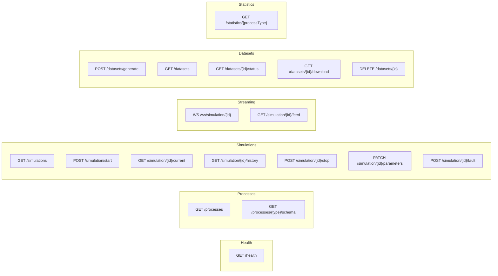

# API Reference

All endpoints are prefixed with `/api`. The backend runs on port 8000 by default. In development, the Vite dev server on port 5173 proxies `/api` and `/ws` to the backend — see [`frontend/vite.config.ts`](../frontend/vite.config.ts).

## Endpoints Overview



## Health

### `GET /api/health`

Returns server health status.

**Response:**
```json
{
  "status": "healthy",
  "uptime": 123.45,
  "version": "0.1.0"
}
```

**Source:** [`backend/app/api/health.py`](../backend/app/api/health.py)

---

## Processes

### `GET /api/processes`

Lists all available simulator types with their full schemas.

**Response:** `ProcessSchema[]`
```json
[
  {
    "name": "refinery",
    "description": "Crude oil atmospheric distillation unit",
    "parameters": [
      { "name": "crudeTemp", "min": 320, "max": 500, "default": 370, "unit": "°C" }
    ],
    "outputs": [
      { "name": "temperature", "unit": "°C", "description": "Column temperature" }
    ]
  }
]
```

### `GET /api/processes/{type}/schema`

Returns schema for a single process type.

**Path parameters:**
- `type` — one of: `refinery`, `chemical`, `pulp`, `pharma`, `rotating`

**Response:** `ProcessSchema` (single object, same shape as above)

**Source:** [`backend/app/api/processes.py`](../backend/app/api/processes.py)

---

## Simulations

### `GET /api/simulations`

Lists all simulations with optional filters.

**Query parameters:**
| Parameter | Type | Description |
|-----------|------|-------------|
| `status` | string | Filter by status: `running`, `stopped`, `completed` |
| `processType` | string | Filter by process type |

**Response:** `SimulationInfo[]`

### `POST /api/simulation/start`

Creates and starts a new simulation. Spawns an asyncio background task that calls `sim.step()` every `intervalMs` milliseconds.

**Request body:**
```json
{
  "processType": "chemical",
  "parameters": { "temperature": 360, "pressure": 25 },
  "intervalMs": 500
}
```

All fields in `parameters` are optional — omitted parameters use simulator defaults. See [Simulators](SIMULATORS.md) for valid parameter names and ranges.

**Response:** `SimulationInfo`
```json
{
  "id": "uuid",
  "processType": "chemical",
  "status": "running",
  "parameters": { "reactantA": 100, "reactantB": 120, "temperature": 360, "pressure": 25, "catalystConc": 1.0, "stirringSpeed": 300 },
  "createdAt": 1713400000.0,
  "stepCount": 0,
  "intervalMs": 500
}
```

### `GET /api/simulation/{id}/current`

Returns the simulation metadata and its latest data point.

**Response:**
```json
{
  "simulation": { "id": "...", "status": "running", "stepCount": 42, "..." : "..." },
  "current": { "timestamp": 42, "temperature": 365.2, "pressure": 24.8, "..." : "..." }
}
```

### `GET /api/simulation/{id}/history`

Returns paginated historical data points.

**Query parameters:**
| Parameter | Type | Default | Description |
|-----------|------|---------|-------------|
| `limit` | int | 100 | Max rows to return |
| `offset` | int | 0 | Skip first N rows |

**Response:**
```json
{
  "simulation": { "..." : "..." },
  "data": [ { "timestamp": 0, "..." : "..." }, { "timestamp": 1, "..." : "..." } ],
  "count": 2
}
```

### `POST /api/simulation/{id}/stop`

Cancels the background task and marks the simulation as stopped.

**Response:** `SimulationInfo` with `status: "stopped"`

### `PATCH /api/simulation/{id}/parameters`

Updates parameters on a running simulation. Takes effect on the next `step()` call.

**Request body:**
```json
{
  "parameters": { "temperature": 380 }
}
```

**Response:** Updated `SimulationInfo`

**Errors:**
- `400` — simulation exists but is not running
- `404` — simulation not found

### `POST /api/simulation/{id}/fault`

Injects a fault into a running rotating equipment simulation.

**Request body:**
```json
{
  "faultType": "bearing_fault"
}
```

Valid fault types: `bearing_fault`, `rotor_imbalance`, `misalignment`, `no_fault`

**Errors:**
- `400` — simulation is not rotating equipment type
- `404` — simulation not found or not running

**Source:** [`backend/app/api/simulations.py`](../backend/app/api/simulations.py)

---

## Real-time Streaming

Both streaming endpoints poll storage for new data points every 500ms and push them to the client. They automatically close when the simulation stops.

### `WS /api/ws/simulation/{id}` (WebSocket)

After connection, receives JSON data points:
```json
{ "timestamp": 42, "temperature": 365.2, "pressure": 24.8, "..." : "..." }
```

On simulation stop:
```json
{ "type": "stopped" }
```

Close code `4004` if simulation not found.

### `GET /api/simulation/{id}/feed` (SSE)

Server-Sent Events stream. Each event:
```
data: {"timestamp": 42, "temperature": 365.2, ...}

```

On simulation stop:
```
data: {"type": "stopped"}

```

The frontend uses SSE by default — see [`connectSSE()`](../frontend/src/services/websocket.ts).

**Source:** [`backend/app/api/streaming.py`](../backend/app/api/streaming.py)

---

## Datasets

### `POST /api/datasets/generate`

Generates a bulk dataset synchronously and stores it.

**Request body:**
```json
{
  "processType": "refinery",
  "samples": 1000,
  "includeAnomalies": true,
  "format": "csv"
}
```

| Field | Type | Default | Constraints |
|-------|------|---------|-------------|
| `processType` | string | required | one of 5 types |
| `samples` | int | required | 1–100,000 |
| `includeAnomalies` | bool | `true` | adds `anomaly` column (0/1) |
| `format` | string | `"csv"` | `"csv"` or `"json"` |

**Response:** `DatasetInfo`
```json
{
  "id": "uuid",
  "processType": "refinery",
  "status": "ready",
  "samples": 1000,
  "includeAnomalies": true,
  "format": "csv",
  "createdAt": 1713400000.0,
  "fileSize": 245000
}
```

### `GET /api/datasets`

Lists all generated datasets.

**Response:** `DatasetInfo[]`

### `GET /api/datasets/{id}/status`

Returns status of a single dataset.

**Response:** `DatasetInfo`

### `GET /api/datasets/{id}/download`

Downloads dataset as a file.

**Query parameters:**
| Parameter | Type | Default |
|-----------|------|---------|
| `format` | string | `"csv"` |

**Response:** Streaming file download with `Content-Disposition` header.

### `DELETE /api/datasets/{id}`

Deletes a dataset and its data.

**Response:** `{ "status": "deleted" }`

**Source:** [`backend/app/api/datasets.py`](../backend/app/api/datasets.py)

---

## Statistics

### `GET /api/statistics/{processType}`

Returns aggregate statistics for a process type.

**Response:**
```json
{
  "processType": "chemical",
  "totalSimulations": 5,
  "totalSteps": 1250,
  "activeSimulations": 1
}
```

**Source:** [`backend/app/api/statistics.py`](../backend/app/api/statistics.py)

---

## RTSP Camera Feeds

RTSP camera feed management with ffmpeg-based HLS transcoding. Each of the 5 process types can have one RTSP camera URL configured. Streams are transcoded to HLS for browser playback.

### `GET /rtsp/config`

Returns RTSP configuration and stream status for all process types.

**Response:** `200 OK`
```json
{
  "refinery": { "url": "rtsp://camera:554/stream", "status": "streaming" },
  "chemical": { "url": null, "status": "offline" },
  "pulp": { "url": null, "status": "offline" },
  "pharma": { "url": null, "status": "offline" },
  "rotating": { "url": null, "status": "offline" }
}
```

Stream status values: `offline`, `starting`, `streaming`, `error`

### `PUT /rtsp/config/{processType}`

Set or clear the RTSP URL for a process type.

**Body:**
```json
{ "url": "rtsp://camera:554/stream" }
```

Pass `null` to clear the URL.

**Response:** `200 OK` — updated config entry

### `POST /rtsp/{processType}/start`

Start ffmpeg transcoding for the configured RTSP URL.

**Response:** `200 OK`
```json
{
  "processType": "refinery",
  "status": "starting",
  "startedAt": "2025-01-15T10:30:00+00:00"
}
```

### `POST /rtsp/{processType}/stop`

Stop the ffmpeg process and clean up HLS files.

**Response:** `200 OK`
```json
{
  "processType": "refinery",
  "status": "offline",
  "startedAt": null
}
```

### `GET /rtsp/{processType}/stream.m3u8`

Serve the HLS playlist for browser playback via hls.js.

**Response:** `200 OK` with `application/vnd.apple.mpegurl` content type

### `GET /rtsp/{processType}/{segment}`

Serve HLS `.ts` segments. Segment names must match `seg\d{3}\.ts`.

**Response:** `200 OK` with `video/mp2t` content type

**Source:** [`backend/app/api/rtsp.py`](../backend/app/api/rtsp.py)

---

## Error Responses

All errors return standard HTTP status codes with a JSON body:

```json
{
  "detail": "Simulation not found"
}
```

| Code | Meaning |
|------|---------|
| 400 | Bad request (invalid process type, wrong simulation type for fault injection) |
| 404 | Resource not found |
| 422 | Validation error (Pydantic) |

## Frontend Client

The TypeScript API client wraps all endpoints with typed functions — see [`frontend/src/services/api.ts`](../frontend/src/services/api.ts). It uses Axios with a 10-second timeout and base URL `/api` (proxied in dev, served directly in production).

## Related Documentation

- [Architecture](ARCHITECTURE.md) — system design and data flow
- [Simulators](SIMULATORS.md) — parameter ranges and output field definitions
- [Data Model](DATA_MODEL.md) — TypeScript and Pydantic type definitions
