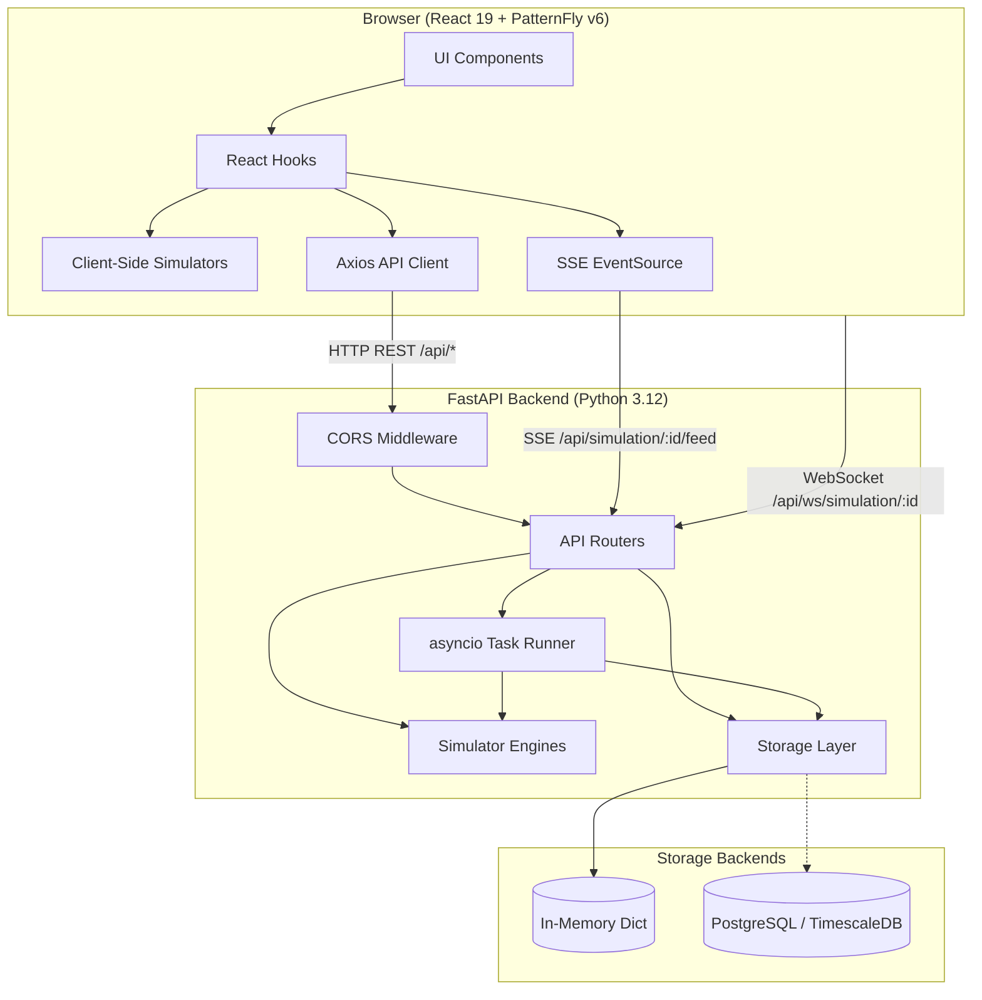
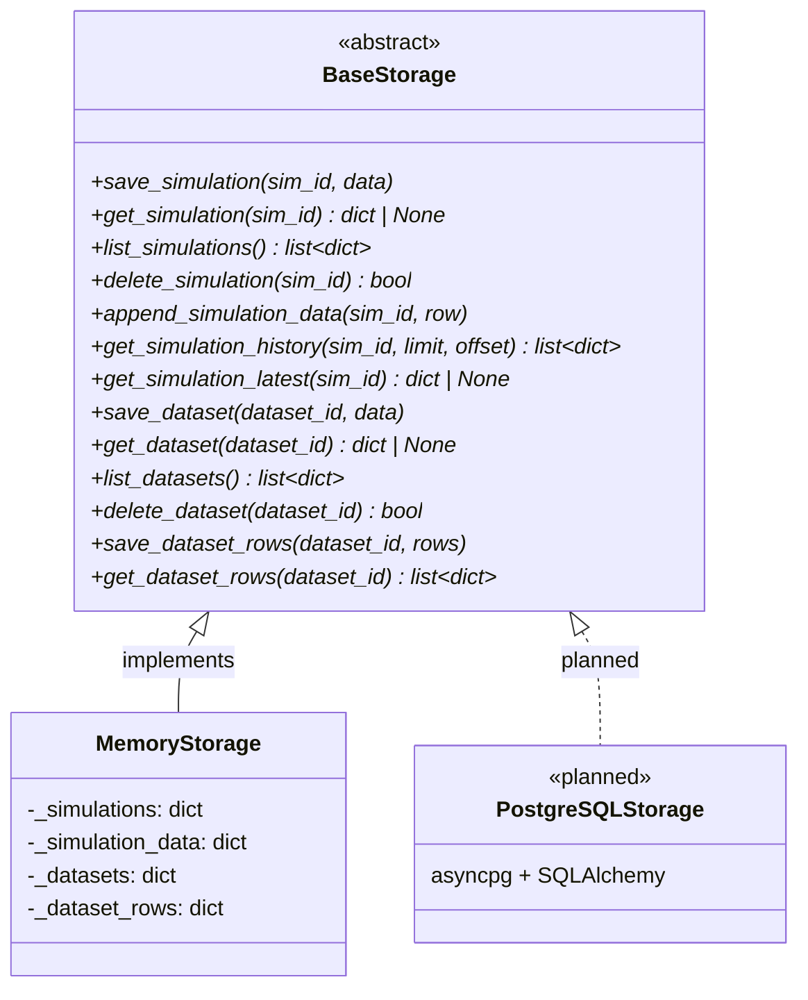
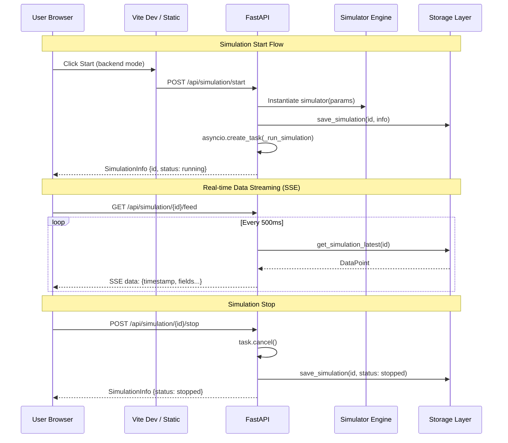

# Architecture

Industrial Datagen is a full-stack simulation platform that generates realistic industrial process data for AI/ML training. It runs five physics-based simulators either in the browser (local mode) or on the server (backend mode), streams data in real time, and exports bulk datasets.

## System Overview



> Full diagram source: [diagrams/system-architecture.mermaid](diagrams/system-architecture.mermaid)

## Key Architecture Decisions

### Dual Simulation Mode

The platform supports two execution modes controlled by a toggle in the UI:

| Aspect | Local Mode | Backend Mode |
|--------|-----------|--------------|
| Execution | Browser (TypeScript) | Server (Python) |
| Data persistence | In-memory, lost on refresh | Storage layer, survives reconnect |
| Real-time streaming | `setInterval` → React state | SSE EventSource from `/api/simulation/{id}/feed` |
| Parameter updates | Direct object mutation | `PATCH /api/simulation/{id}/parameters` |
| Fault injection | Direct method call | `POST /api/simulation/{id}/fault` |
| Use case | Quick exploration, demos | Production datasets, long runs |

Both modes use identical physics models — the TypeScript simulators in [`frontend/src/simulators/`](../frontend/src/simulators/) mirror the Python engines in [`backend/app/simulators/`](../backend/app/simulators/).

### Pluggable Storage

All data access goes through the abstract [`BaseStorage`](../backend/app/storage/base.py) interface (14 async methods). The default [`MemoryStorage`](../backend/app/storage/memory.py) uses Python dicts and requires no external dependencies. PostgreSQL/TimescaleDB is opt-in via the `INDGEN_STORAGE_BACKEND` and `INDGEN_DATABASE_URL` environment variables.



> Full diagram source: [diagrams/storage-interface.mermaid](diagrams/storage-interface.mermaid)

### Real-time Streaming

Two transport options for live simulation data:

1. **SSE (Server-Sent Events)** — `GET /api/simulation/{id}/feed`. The frontend uses this by default via [`connectSSE()`](../frontend/src/services/websocket.ts). Works through HTTP proxies and load balancers without special configuration.

2. **WebSocket** — `WS /api/ws/simulation/{id}`. Lower latency alternative. Both poll [`storage.get_simulation_latest()`](../backend/app/storage/base.py) every 500ms and push new data points to the client.

### RTSP Camera Feeds

Each of the 5 industrial process types can have one RTSP camera URL configured. The [`RTSPStreamManager`](../backend/app/rtsp/manager.py) manages ffmpeg subprocess lifecycle:

1. User sets RTSP URL via `PUT /api/rtsp/config/{processType}`
2. User starts stream via `POST /api/rtsp/{processType}/start`
3. Manager spawns `ffmpeg` with `-f hls` output, writing `.m3u8` playlist and `.ts` segments to `/tmp/rtsp-streams/{processType}/`
4. Manager monitors ffmpeg stderr for `frame=`/`fps=` patterns to detect STARTING → STREAMING transition
5. Frontend uses [hls.js](https://github.com/video-dev/hls.js) to play `GET /api/rtsp/{processType}/stream.m3u8`
6. On stop, manager terminates ffmpeg and cleans up temp files

### Application Lifecycle

The FastAPI app uses a [lifespan context manager](../backend/app/main.py) to:
- Initialize `app.state.storage` (MemoryStorage instance)
- Initialize `app.state.active_simulations` (live simulator objects by ID)
- Initialize `app.state.simulation_tasks` (asyncio tasks by ID)
- Initialize `app.state.rtsp_manager` (RTSPStreamManager instance)
- Stop all RTSP streams and cancel all simulation tasks on shutdown

### Static File Serving

In production, the backend serves the compiled React SPA from `/app/static/`. The [`INDGEN_STATIC_DIR`](../backend/app/main.py) environment variable controls the path. All non-API routes fall through to `index.html` for client-side routing.

## Request Lifecycle



> Full diagram source: [diagrams/request-lifecycle.mermaid](diagrams/request-lifecycle.mermaid)

## Project Structure

```
industrial-datagen/
├── backend/                          # Python FastAPI backend
│   ├── app/
│   │   ├── main.py                   # App factory, lifespan, CORS, routes, SPA serving
│   │   ├── config.py                 # Pydantic Settings (INDGEN_* env vars)
│   │   ├── api/                      # Route handlers
│   │   │   ├── health.py             # GET /api/health
│   │   │   ├── processes.py          # GET /api/processes, /api/processes/{type}/schema
│   │   │   ├── simulations.py        # CRUD + lifecycle for simulations
│   │   │   ├── datasets.py           # Generate, list, download, delete datasets
│   │   │   ├── statistics.py         # GET /api/statistics/{processType}
│   │   │   └── streaming.py          # WebSocket + SSE real-time feeds
│   │   ├── models/                   # Pydantic request/response schemas
│   │   │   ├── simulation.py         # StartSimulationRequest, SimulationStatus, etc.
│   │   │   └── dataset.py            # GenerateDatasetRequest, DatasetStatus, etc.
│   │   ├── simulators/               # Physics-based simulation engines
│   │   │   ├── base.py               # BaseSimulator ABC + ParameterDef + OutputField
│   │   │   ├── refinery.py           # Crude oil distillation (4 params, 17 outputs)
│   │   │   ├── chemical.py           # CSTR reactor (6 params, 17 outputs)
│   │   │   ├── pulp.py               # Kraft digester (6 params, 25 outputs)
│   │   │   ├── pharma.py             # GMP batch reactor (7 params, 26 outputs)
│   │   │   └── rotating.py           # Predictive maintenance (6 params, 20 outputs)
│   │   └── storage/                  # Pluggable persistence
│   │       ├── base.py               # BaseStorage ABC (14 async methods)
│   │       └── memory.py             # In-memory dict implementation
│   └── tests/                        # pytest + pytest-bdd
│       ├── unit/                     # Simulator unit tests
│       ├── integration/              # API integration tests (httpx AsyncClient)
│       └── features/                 # BDD Gherkin features + step defs
├── frontend/                         # React 19 + TypeScript + PatternFly v6
│   ├── src/
│   │   ├── main.tsx                  # ReactDOM entry point
│   │   ├── App.tsx                   # Router, navigation, layout
│   │   ├── types/index.ts            # Shared TypeScript interfaces
│   │   ├── services/
│   │   │   ├── api.ts                # Axios HTTP client (all REST endpoints)
│   │   │   └── websocket.ts          # SSE EventSource connector
│   │   ├── hooks/
│   │   │   ├── useSimulation.ts      # Core simulation state machine
│   │   │   └── useDataset.ts         # Dataset CRUD operations
│   │   ├── simulators/               # Client-side TypeScript engines
│   │   │   ├── base.ts               # BaseSimulator (mirrors Python ABC)
│   │   │   ├── refinery.ts           # ... mirrors backend physics
│   │   │   ├── chemical.ts
│   │   │   ├── pulp.ts
│   │   │   ├── pharma.ts
│   │   │   ├── rotating.ts
│   │   │   └── index.ts              # createSimulator() factory
│   │   ├── components/               # PatternFly UI components
│   │   │   ├── ProcessSelector/
│   │   │   ├── SimulationControls/
│   │   │   ├── ParameterPanel/
│   │   │   ├── LiveChart/
│   │   │   ├── StatisticsPanel/
│   │   │   ├── AnomalyPanel/
│   │   │   └── DatasetManager/
│   │   └── pages/
│   │       ├── Dashboard.tsx          # Main simulation interface
│   │       └── Datasets.tsx           # Dataset management
│   └── tests/
│       ├── components/               # Vitest + React Testing Library
│       ├── simulators/               # TypeScript engine unit tests
│       └── e2e/                      # Playwright E2E tests
├── deploy/
│   ├── Containerfile                 # Multi-stage OCI build
│   ├── docker-compose.yml            # Dev + prod + postgres profiles
│   ├── openshift/                    # K8s/OpenShift manifests
│   │   ├── deployment.yaml
│   │   ├── service.yaml
│   │   ├── configmap.yaml
│   │   └── route.yaml
│   └── bootc/                        # Immutable OS image
│       ├── Containerfile
│       ├── build.sh
│       ├── prepare-src.sh
│       └── convert-to-qcow2.sh
├── docs/                             # This documentation
│   ├── ARCHITECTURE.md               # ← You are here
│   ├── API_REFERENCE.md
│   ├── SIMULATORS.md
│   ├── DEVELOPMENT.md
│   ├── DEPLOYMENT.md
│   ├── DATA_MODEL.md
│   └── diagrams/                     # Standalone .mermaid source files
├── Makefile                          # Dev workflow commands
└── CLAUDE.md                         # AI development context
```

## Related Documentation

- [API Reference](API_REFERENCE.md) — all REST, WebSocket, and SSE endpoints
- [Simulators](SIMULATORS.md) — physics models, parameters, output fields
- [Data Model](DATA_MODEL.md) — TypeScript/Pydantic types, storage contracts
- [Development](DEVELOPMENT.md) — setup, testing, code conventions
- [Deployment](DEPLOYMENT.md) — container builds, OpenShift, bootc
