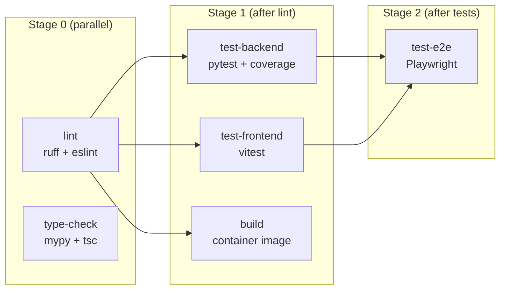

# CI/CD

GitHub Actions automates testing, linting, and container image builds for every push and pull request.

## CI Pipeline



### Triggers

| Event | Branches | Workflow |
|-------|----------|----------|
| `push` | `main` | CI |
| `pull_request` | `main` | CI |
| `push` (tags `v*`) | — | Release |
| `workflow_dispatch` | — | Release |

### CI Jobs

| Job | Depends On | What It Does |
|-----|-----------|--------------|
| `lint` | — | `ruff check` (backend) + `eslint` (frontend) |
| `type-check` | — | `mypy` (backend) + `tsc --noEmit` (frontend) |
| `test-backend` | `lint` | `pytest` with coverage report (uploaded as artifact) |
| `test-frontend` | `lint` | `vitest run` |
| `test-e2e` | `test-backend`, `test-frontend` | Playwright against both dev servers |
| `build` | `lint` | `docker build` — validates the container builds |

In-progress CI runs for the same branch/PR are automatically cancelled when a new push arrives.

---

## Release Pipeline

The release workflow builds and pushes the container image to Quay.io when a version tag is pushed.

### Image Tags

| Tag | When Applied |
|-----|-------------|
| `quay.io/iesc/industrial-datagen:<version>` | Every release (e.g. `0.1.0` from tag `v0.1.0`) |
| `quay.io/iesc/industrial-datagen:latest` | Moves with each release tag |
| `quay.io/iesc/industrial-datagen:sha-<short>` | Every release |

### Creating a Release

```bash
# Tag the release
git tag v0.1.0
git push origin v0.1.0
```

The release workflow runs the full test suite before building. If tests fail, the image is not pushed.

### Required Secrets

Configure these in GitHub repository settings under **Settings → Secrets and variables → Actions**:

| Secret | Description |
|--------|-------------|
| `QUAY_USERNAME` | Quay.io robot account or username |
| `QUAY_PASSWORD` | Quay.io robot account token or password |

---

## Local Verification with act

[act](https://github.com/nektos/act) runs GitHub Actions workflows locally using container runtimes.

### Install act

```bash
# Fedora/RHEL
sudo dnf install act-cli

# macOS
brew install act

# Or from GitHub releases
curl -s https://raw.githubusercontent.com/nektos/act/master/install.sh | sudo bash
```

### Usage

The project includes an `.actrc` file with defaults for the `ubuntu-latest` image and `CI=true` environment variable.

```bash
# List all workflows and jobs
act -l

# Dry run (validate syntax without executing)
act pull_request --dryrun

# Run the CI workflow (push event)
act push

# Run a specific job
act push -j lint
act push -j test-backend

# Run the release workflow with a tag event
act push --eventpath .github/test-events/tag-push.json
```

### Limitations

- Container build jobs may not work inside act containers (nested container runtimes)
- Playwright E2E tests may fail due to missing browser dependencies in the act image
- `actions/upload-artifact` does not persist artifacts locally

---

## Troubleshooting

### Common CI Failures

| Symptom | Cause | Fix |
|---------|-------|-----|
| `ruff check` fails | Lint violations in Python code | Run `uv run ruff check --fix app/ tests/` locally |
| `tsc --noEmit` fails | TypeScript type errors | Run `pnpm exec tsc --noEmit` locally |
| `mypy` fails | Missing type annotations | Run `uv run mypy app/` locally and fix reported errors |
| `pnpm install --frozen-lockfile` fails | Lockfile out of sync with package.json | Run `pnpm install` locally and commit the updated lockfile |
| `uv sync` fails | Lockfile out of sync with pyproject.toml | Run `uv sync` locally and commit the updated lockfile |
| Playwright timeout | Dev servers slow to start | Increase `timeout` in `playwright.config.ts` |
| Container build fails | Frontend build error | Run `pnpm run build` locally to reproduce |

### Running CI Checks Locally

Before pushing, run the same checks CI will run:

```bash
make lint          # ruff + eslint
make type-check    # mypy + tsc
make test          # pytest + vitest
make test-e2e      # playwright (requires servers)
make build         # container build
```

## Related Documentation

- [Development](DEVELOPMENT.md) — local setup, testing commands, code conventions
- [Deployment](DEPLOYMENT.md) — container builds, OpenShift, bootc
- [Architecture](ARCHITECTURE.md) — system design
