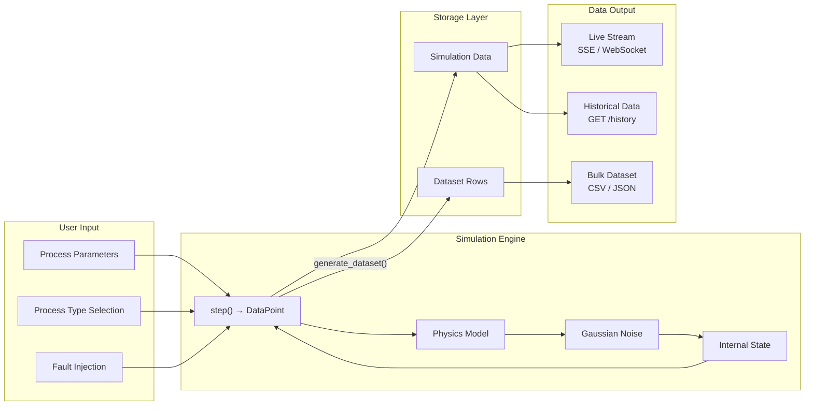
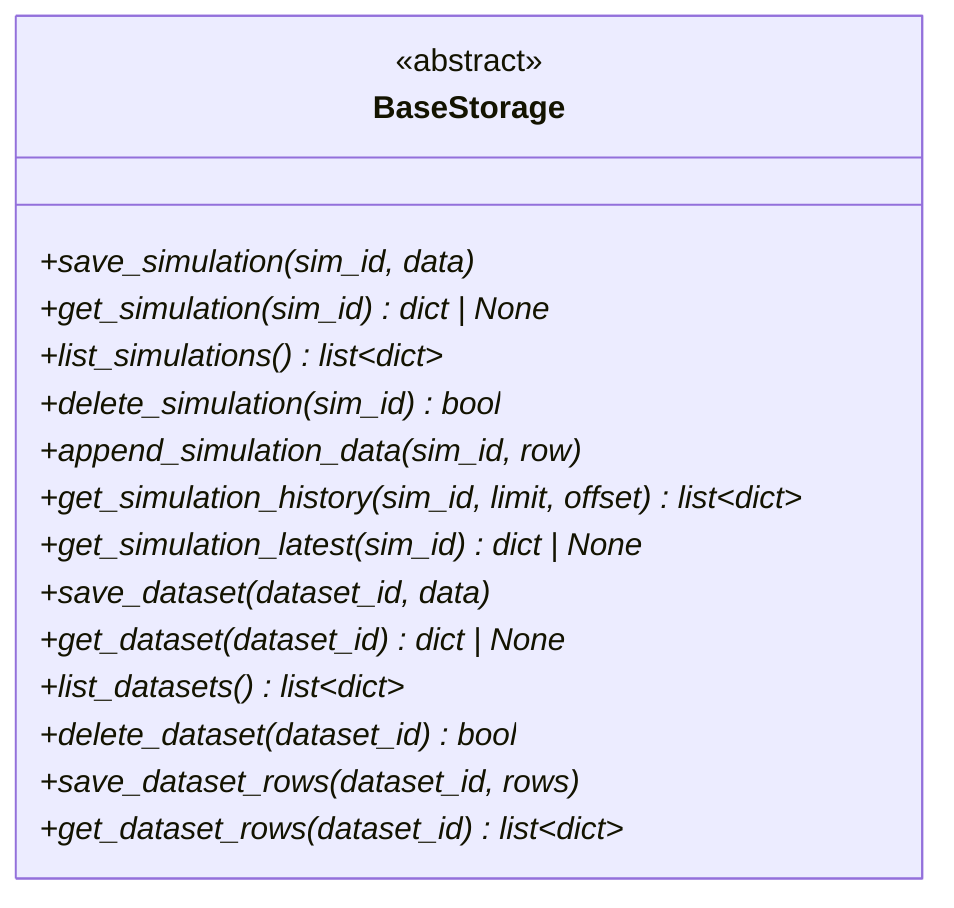

# Data Model

This document defines the shared data types used across the frontend and backend, and documents the storage layer contract.

## Data Flow



> Full diagram source: [diagrams/data-flow.mermaid](diagrams/data-flow.mermaid)

---

## Core Types

### ProcessType

The union of all simulator identifiers.

**TypeScript** ([`frontend/src/types/index.ts`](../frontend/src/types/index.ts)):
```typescript
type ProcessType = 'refinery' | 'chemical' | 'pulp' | 'pharma' | 'rotating';
```

**Python** ([`backend/app/api/simulations.py`](../backend/app/api/simulations.py)):
Process types are string values validated by `get_simulator_class()` in [`backend/app/simulators/__init__.py`](../backend/app/simulators/__init__.py).

---

### ParameterDef

Describes a tunable input parameter for a simulator.

**TypeScript:**
```typescript
interface ParameterDef {
  name: string;       // Parameter identifier (e.g. "crudeTemp")
  label: string;      // Display label
  min: number;        // Minimum allowed value
  max: number;        // Maximum allowed value
  default: number;    // Default value
  unit: string;       // Unit of measure (e.g. "°C", "bar")
}
```

**Python** ([`backend/app/simulators/base.py`](../backend/app/simulators/base.py)):
```python
@dataclass
class ParameterDef:
    name: str
    min_val: float
    max_val: float
    default: float
    unit: str
```

---

### OutputField

Describes a single output value produced by `step()`.

**TypeScript:**
```typescript
interface OutputField {
  name: string;        // Field identifier (e.g. "temperature")
  description: string; // Human-readable description
}
```

**Python:**
```python
@dataclass
class OutputField:
    name: str
    unit: str
    description: str = ""
```

---

### ProcessSchema

Full schema for a simulator type, returned by `GET /api/processes`.

**TypeScript:**
```typescript
interface ProcessSchema {
  name: ProcessType;
  description: string;
  parameters: ParameterDef[];
  outputs: OutputField[];
}
```

**Python:** Generated by `BaseSimulator.get_schema()` — see [`backend/app/simulators/base.py:52-70`](../backend/app/simulators/base.py).

---

### DataPoint

A single row of simulation output. Shape varies by process type — all share `timestamp` plus type-specific numeric fields.

**TypeScript:**
```typescript
interface DataPoint {
  timestamp: number;
  [key: string]: number | string | boolean;
}
```

**Python:** A plain `dict` returned by `BaseSimulator.step()`. Keys match the `name` values from `output_fields()`.

---

### SimulationInfo

Metadata for a running or completed simulation.

**TypeScript:**
```typescript
interface SimulationInfo {
  id: string;
  processType: ProcessType;
  status: 'running' | 'stopped' | 'completed';
  parameters: Record<string, number>;
  startedAt: string;
  steps: number;
}
```

**Python** ([`backend/app/models/simulation.py`](../backend/app/models/simulation.py)):
```python
class SimulationStatus(str, Enum):
    RUNNING = "running"
    STOPPED = "stopped"
    COMPLETED = "completed"
```

Stored in the storage layer as a dict with keys: `id`, `processType`, `status`, `parameters`, `createdAt`, `stepCount`, `intervalMs`.

---

### DatasetInfo

Metadata for a generated dataset.

**TypeScript:**
```typescript
interface DatasetInfo {
  id: string;
  processType: ProcessType;
  status: 'generating' | 'ready' | 'failed';
  samples: number;
  includeAnomalies: boolean;
  format: string;
  createdAt: string;
}
```

**Python** ([`backend/app/models/dataset.py`](../backend/app/models/dataset.py)):
```python
class DatasetStatus(str, Enum):
    GENERATING = "generating"
    READY = "ready"
    FAILED = "failed"
```

---

### FaultType

Available fault modes for rotating equipment simulator.

**TypeScript:**
```typescript
type FaultType = 'bearing_fault' | 'rotor_imbalance' | 'misalignment' | 'no_fault';
```

---

### HealthInfo

Server health status returned by `GET /api/health`.

**TypeScript:**
```typescript
interface HealthInfo {
  status: string;
  uptime: number;
  version: string;
  activeSimulations: number;
}
```

---

## Request Models (Backend)

Pydantic models for API request validation:

### StartSimulationRequest

[`backend/app/models/simulation.py`](../backend/app/models/simulation.py)

| Field | Type | Default | Description |
|-------|------|---------|-------------|
| `processType` | str | required | Simulator type |
| `parameters` | dict[str, float] | `{}` | Override default parameters |
| `intervalMs` | int | 500 | Step interval in milliseconds |

### ParameterUpdateRequest

| Field | Type | Description |
|-------|------|-------------|
| `parameters` | dict[str, float] | Parameters to update |

### FaultRequest

| Field | Type | Description |
|-------|------|-------------|
| `faultType` | str | One of the `FaultType` values |

### GenerateDatasetRequest

[`backend/app/models/dataset.py`](../backend/app/models/dataset.py)

| Field | Type | Default | Constraints | Description |
|-------|------|---------|-------------|-------------|
| `processType` | str | required | | Simulator type |
| `samples` | int | required | 1–100,000 | Number of data points |
| `includeAnomalies` | bool | `true` | | Add anomaly column |
| `format` | str | `"csv"` | `"csv"` or `"json"` | Output format |

---

## Storage Contract

The [`BaseStorage`](../backend/app/storage/base.py) abstract class defines 14 async methods that any storage backend must implement:



### Data Organization

The storage layer manages four collections:

| Collection | Key | Value | Written By |
|------------|-----|-------|-----------|
| Simulations | `sim_id` | `SimulationInfo` dict | `POST /simulation/start`, `_run_simulation()` |
| Simulation Data | `sim_id` → list | `DataPoint` dicts (append-only) | `_run_simulation()` loop |
| Datasets | `dataset_id` | `DatasetInfo` dict | `POST /datasets/generate` |
| Dataset Rows | `dataset_id` → list | `DataPoint` dicts (bulk write) | `POST /datasets/generate` |

### MemoryStorage Implementation

[`backend/app/storage/memory.py`](../backend/app/storage/memory.py) uses four Python dicts:

```python
_simulations: dict[str, dict]       # sim_id → SimulationInfo
_simulation_data: dict[str, list]   # sim_id → [DataPoint, ...]
_datasets: dict[str, dict]          # dataset_id → DatasetInfo
_dataset_rows: dict[str, list]      # dataset_id → [DataPoint, ...]
```

All data is lost on process restart. This is intentional for the default demo/development mode.

## Related Documentation

- [Architecture](ARCHITECTURE.md) — storage abstraction design
- [API Reference](API_REFERENCE.md) — how types map to request/response bodies
- [Simulators](SIMULATORS.md) — what each DataPoint contains per process type
