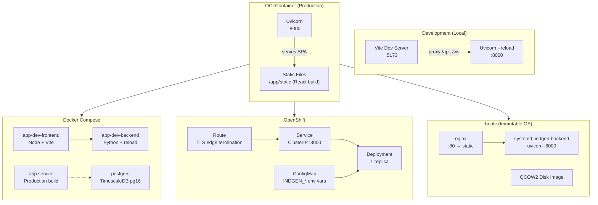

# Deployment

Industrial Datagen supports three deployment targets: OCI containers, OpenShift/Kubernetes, and bootc immutable OS images.

## Deployment Topology



> Full diagram source: [diagrams/deployment-topology.mermaid](diagrams/deployment-topology.mermaid)

---

## OCI Container Build

The multi-stage [`deploy/Containerfile`](../deploy/Containerfile) produces a single image:

1. **Stage 1 (Node 22 Alpine):** Builds the React frontend (`pnpm install --frozen-lockfile` + `pnpm run build` → `dist/`)
2. **Stage 2 (Python 3.12 slim):** Installs backend dependencies, copies built frontend to `/app/static/`

```bash
# Build with podman
make build
# → podman build -f deploy/Containerfile -t industrial-datagen:latest .

# Build with docker
docker build -f deploy/Containerfile -t industrial-datagen:latest .

# Run locally
podman run -p 8000:8000 industrial-datagen:latest
# → http://localhost:8000
```

The container exposes port 8000. Uvicorn serves both the API (`/api/*`) and the SPA (all other routes → `index.html`).

**Image labels:**
- `org.opencontainers.image.title`: Industrial Datagen
- `org.opencontainers.image.version`: 0.1.0
- `org.opencontainers.image.vendor`: Red Hat Demo

---

## Docker Compose

[`deploy/docker-compose.yml`](../deploy/docker-compose.yml) provides three configurations via profiles:

### Production

```bash
docker compose -f deploy/docker-compose.yml up app
```

Builds from `Containerfile` and runs on port 8000.

### Development

```bash
docker compose -f deploy/docker-compose.yml --profile dev up
```

| Service | Image | Port | Features |
|---------|-------|------|----------|
| `app-dev-backend` | python:3.12-slim | 8000 | Volume mount, `--reload` |
| `app-dev-frontend` | node:22-alpine | 5173 | Volume mount, Vite proxy to backend |

### With PostgreSQL

```bash
docker compose -f deploy/docker-compose.yml --profile db up app postgres
```

Adds TimescaleDB (PostgreSQL 16) on port 5432. Set `INDGEN_STORAGE_BACKEND=postgres` and `INDGEN_DATABASE_URL` to use it.

---

## OpenShift / Kubernetes

Manifests are in [`deploy/openshift/`](../deploy/openshift/). Apply in order:

```bash
oc apply -f deploy/openshift/configmap.yaml
oc apply -f deploy/openshift/deployment.yaml
oc apply -f deploy/openshift/service.yaml
oc apply -f deploy/openshift/route.yaml
```

### Manifests

| File | Resource | Purpose |
|------|----------|---------|
| [`configmap.yaml`](../deploy/openshift/configmap.yaml) | ConfigMap | `INDGEN_*` environment variables |
| [`deployment.yaml`](../deploy/openshift/deployment.yaml) | Deployment | 1 replica, resource limits, health probes |
| [`service.yaml`](../deploy/openshift/service.yaml) | Service | ClusterIP on port 8000 |
| [`route.yaml`](../deploy/openshift/route.yaml) | Route | TLS edge termination |

### Resource Limits

| Resource | Request | Limit |
|----------|---------|-------|
| CPU | 250m | 1 |
| Memory | 256Mi | 512Mi |

### Health Probes

| Probe | Endpoint | Initial Delay | Period |
|-------|----------|---------------|--------|
| Liveness | `GET /api/health` | 5s | 30s |
| Readiness | `GET /api/health` | 3s | 10s |

### Configuration

The ConfigMap sets:
```yaml
INDGEN_DEBUG: "false"
INDGEN_STORAGE_BACKEND: "memory"
INDGEN_CORS_ORIGINS: '["*"]'
INDGEN_STATIC_DIR: "/app/static"
```

The container image defaults to `quay.io/rh-ee-mhillsma/industrial-datagen:latest`. Update the image reference in [`deployment.yaml`](../deploy/openshift/deployment.yaml) for your registry.

---

## bootc (Immutable OS)

The [`deploy/bootc/`](../deploy/bootc/) directory packages the application as an immutable operating system image using [bootc](https://containers.github.io/bootc/).

### Base Image

`quay.io/centos-bootc/centos-stream-bootc:stream9`

### Installed Components

- nginx (reverse proxy, serves static frontend)
- Python 3.12 + uv (backend runtime)
- Application code at `/usr/share/indgen/`

### Systemd Services

| Service | Description |
|---------|-------------|
| `indgen-backend` | uvicorn on port 8000 |
| `indgen-frontend` | static file build |
| `nginx` | reverse proxy on port 80 |

### Build & Convert

```bash
# Prepare source files
cd deploy/bootc && ./prepare-src.sh

# Build bootc container image
./build.sh

# Convert to QCOW2 disk image for VMs
./convert-to-qcow2.sh
```

### Default Credentials

- User: `otoperator`
- Password: `changeme`

---

## Environment Variables Reference

| Variable | Default | Used By | Description |
|----------|---------|---------|-------------|
| `INDGEN_DEBUG` | `false` | Backend | Enable debug logging |
| `INDGEN_CORS_ORIGINS` | `["*"]` | Backend | CORS allowed origins |
| `INDGEN_STORAGE_BACKEND` | `memory` | Backend | `memory` or `postgres` |
| `INDGEN_DATABASE_URL` | `""` | Backend | PostgreSQL connection string |
| `INDGEN_STATIC_DIR` | `""` | Backend | Path to frontend build for SPA serving |

## Related Documentation

- [Architecture](ARCHITECTURE.md) — system design and how SPA serving works
- [Development](DEVELOPMENT.md) — local development setup
- [API Reference](API_REFERENCE.md) — health endpoint used by probes
