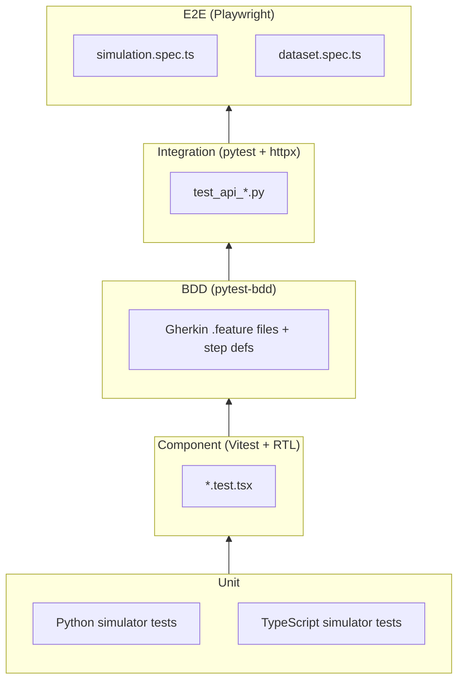

# Development Guide

## Prerequisites

- Python 3.12+
- Node.js 22+
- [pnpm](https://pnpm.io/)
- [uv](https://docs.astral.sh/uv/)
- podman or docker (for container builds)

## Quick Start

### Backend

```bash
cd backend
uv sync --extra test --extra dev
```

Start the dev server:
```bash
make dev-backend
# → uvicorn on http://localhost:8000 with --reload
```

### Frontend

```bash
cd frontend
pnpm install
```

Start the dev server:
```bash
make dev-frontend
# → Vite on http://localhost:5173
```

The Vite dev server proxies `/api` and `/ws` to the backend at `localhost:8000` — see [`frontend/vite.config.ts`](../frontend/vite.config.ts).

### Docker Compose (Full Stack)

```bash
# Production mode
docker compose -f deploy/docker-compose.yml up app

# Development mode (hot reload on both ends)
docker compose -f deploy/docker-compose.yml --profile dev up

# With PostgreSQL
docker compose -f deploy/docker-compose.yml --profile db up app postgres
```

## Configuration

All backend settings use the `INDGEN_` prefix and are managed by Pydantic Settings in [`backend/app/config.py`](../backend/app/config.py):

| Variable | Default | Description |
|----------|---------|-------------|
| `INDGEN_DEBUG` | `false` | Enable debug mode |
| `INDGEN_CORS_ORIGINS` | `["*"]` | Allowed CORS origins (JSON array) |
| `INDGEN_STORAGE_BACKEND` | `memory` | Storage backend (`memory` or `postgres`) |
| `INDGEN_DATABASE_URL` | `""` | PostgreSQL connection string |
| `INDGEN_STATIC_DIR` | `""` | Path to compiled frontend (enables SPA serving) |

## Testing



> Full diagram source: [diagrams/testing-pyramid.mermaid](diagrams/testing-pyramid.mermaid)

### Run All Tests

```bash
make test              # backend + frontend unit/component tests
make test-backend      # pytest with coverage report
make test-frontend     # vitest
make test-e2e          # playwright (requires both servers running)
```

### Backend Tests

```bash
cd backend

# All tests with coverage
uv run pytest -v --cov=app --cov-report=term-missing

# Unit tests only
uv run pytest tests/unit/ -v

# Integration tests only
uv run pytest tests/integration/ -v

# BDD feature tests only
uv run pytest tests/features/ -v

# Single test file
uv run pytest tests/unit/test_refinery.py -v
```

**Test fixtures** are in [`backend/tests/conftest.py`](../backend/tests/conftest.py). The main fixture provides an `httpx.AsyncClient` configured against the FastAPI test app.

**BDD features** are in [`backend/tests/features/`](../backend/tests/features/) using Gherkin `.feature` files with step definitions in `steps/`.

### Frontend Tests

```bash
cd frontend

# Component + simulator unit tests
pnpm exec vitest run

# Watch mode
pnpm exec vitest

# Single file
pnpm exec vitest run tests/components/ProcessSelector.test.tsx
```

**Test setup:** [`frontend/src/test-setup.ts`](../frontend/src/test-setup.ts) configures jsdom and `@testing-library/jest-dom` matchers.

### E2E Tests

```bash
# Install browsers (first time)
pnpm exec playwright install

# Run E2E tests (starts both servers automatically)
make test-e2e

# Or manually:
cd frontend && pnpm exec playwright test

# With UI
pnpm exec playwright test --ui

# Debug mode
pnpm exec playwright test --debug
```

Playwright config is at [`frontend/playwright.config.ts`](../frontend/playwright.config.ts). It starts both the backend (port 8000) and frontend (port 5173) dev servers automatically via `webServer`.

## Linting & Type Checking

```bash
make lint              # ruff (backend) + tsc --noEmit (frontend)
make type-check        # mypy (backend) + tsc --noEmit (frontend)
```

### Backend

- **Linter:** [ruff](https://docs.astral.sh/ruff/) — config in [`backend/pyproject.toml`](../backend/pyproject.toml)
- **Type checker:** [mypy](https://mypy.readthedocs.io/) — config in [`backend/pyproject.toml`](../backend/pyproject.toml)

### Frontend

- **Linter:** ESLint 9 with TypeScript and React plugins — config in [`frontend/eslint.config.js`](../frontend/eslint.config.js)
- **Type checker:** TypeScript strict mode — config in [`frontend/tsconfig.app.json`](../frontend/tsconfig.app.json)

## Code Conventions

### Commits

All commits follow [Conventional Commits](https://www.conventionalcommits.org/):

```
feat: add rotating equipment fault injection
fix: correct kappa number calculation in pulp simulator
test: add BDD scenarios for dataset anomaly generation
chore: update FastAPI to 0.115
docs: add API reference documentation
refactor: extract base simulator noise methods
```

One concern per commit. Tests must pass before committing.

### Backend

- **Pydantic models** for all request/response schemas — see [`backend/app/models/`](../backend/app/models/)
- **Type hints** on all function signatures
- **async/await** for all storage and API operations
- **No ORM in default mode** — MemoryStorage uses plain dicts

### Frontend

- **TypeScript strict mode** — no `any` types
- **PatternFly v6** components — no custom CSS for standard UI patterns
- **Barrel exports** — each component directory has an `index.ts`
- **Custom hooks** encapsulate business logic — components are presentational

### Adding a New Simulator

1. Create `backend/app/simulators/newsim.py` extending `BaseSimulator`
2. Register it in `backend/app/simulators/__init__.py`
3. Create `frontend/src/simulators/newsim.ts` extending `BaseSimulator`
4. Register it in `frontend/src/simulators/index.ts`
5. Add the process type to `frontend/src/types/index.ts` (`ProcessType` union)
6. Write unit tests for both implementations
7. Write integration tests for the API endpoints

## Dependencies

### Backend ([`backend/pyproject.toml`](../backend/pyproject.toml))

| Package | Purpose |
|---------|---------|
| `fastapi` | Web framework |
| `uvicorn[standard]` | ASGI server |
| `pydantic` / `pydantic-settings` | Data validation + config |
| `python-multipart` | Form data parsing |
| `asyncpg` + `sqlalchemy[asyncio]` | PostgreSQL (optional) |
| `pytest` + `pytest-asyncio` + `pytest-bdd` | Testing |
| `httpx` | Async HTTP test client |
| `ruff` | Linting |
| `mypy` | Type checking |

### Frontend ([`frontend/package.json`](../frontend/package.json))

| Package | Purpose |
|---------|---------|
| `react` / `react-dom` | UI framework |
| `react-router-dom` | Client-side routing |
| `@patternfly/react-*` | Red Hat design system |
| `victory` | Chart library |
| `axios` | HTTP client |
| `vite` | Build tool + dev server |
| `vitest` | Unit test runner |
| `@testing-library/react` | Component test utilities |
| `@playwright/test` | E2E testing |
| `typescript` | Type checking |
| `eslint` | Linting |

## CI/CD

GitHub Actions runs lint, type check, tests, and container build on every PR and push to main. See [CI/CD](CI_CD.md) for full details.

To verify workflows locally with [act](https://github.com/nektos/act):

```bash
act -l                      # list all jobs
act pull_request --dryrun   # validate syntax
act push -j lint            # run a specific job
```

## Related Documentation

- [Architecture](ARCHITECTURE.md) — system design and project structure
- [API Reference](API_REFERENCE.md) — endpoint documentation
- [CI/CD](CI_CD.md) — GitHub Actions workflows and local verification
- [Deployment](DEPLOYMENT.md) — container builds and infrastructure
