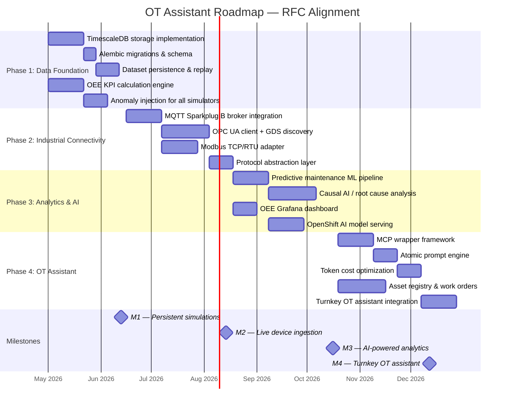
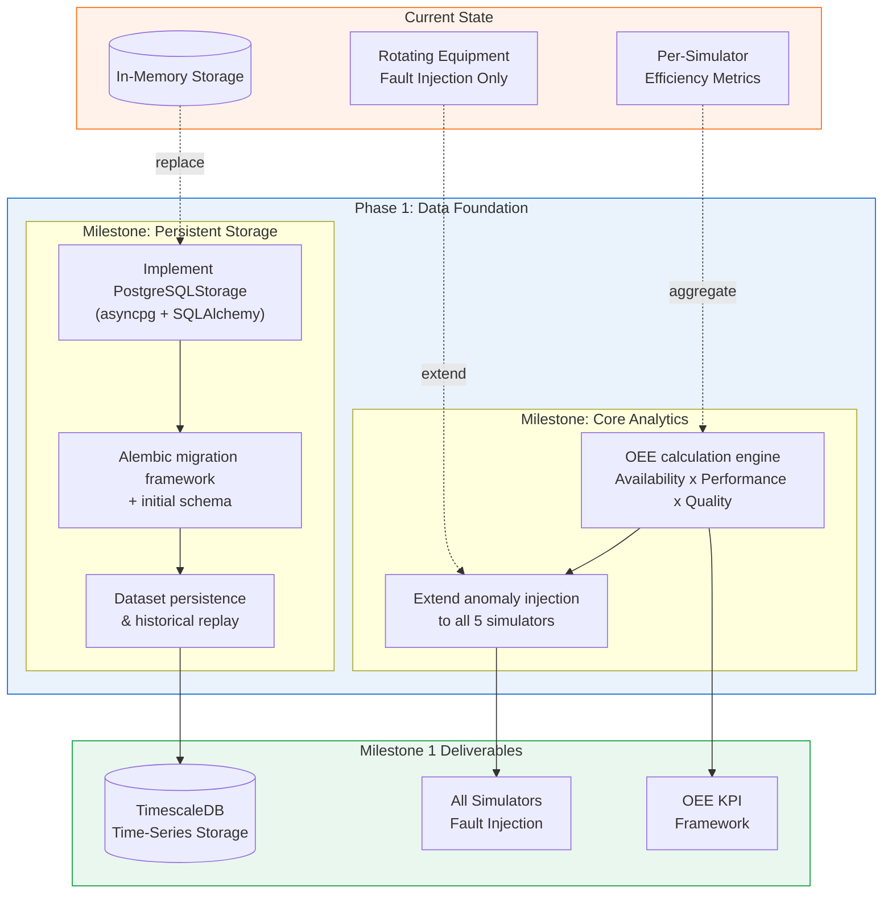
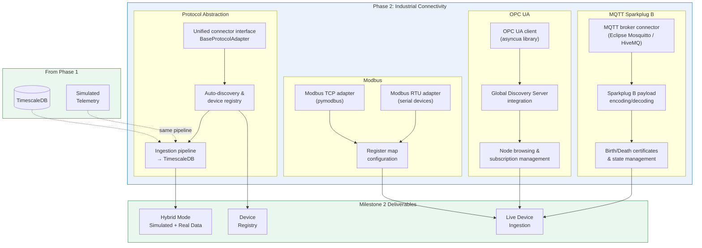
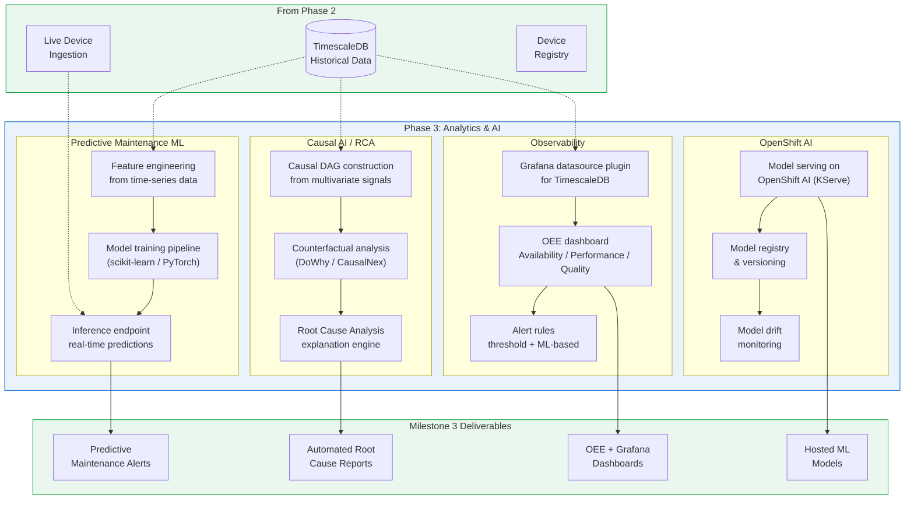
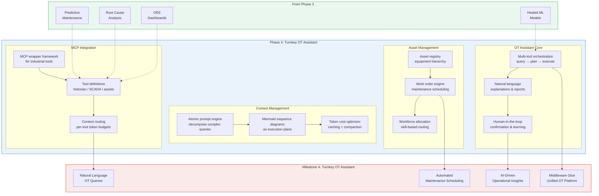

# Roadmap

This document outlines the phased plan to evolve Industrial Datagen from a synthetic data generation platform into a turnkey Operational Technology (OT) assistant. The roadmap is driven by the requirements identified in the [Industrial Tools Analysis RFC](rfc/industrial_tools_analysis.md).

## Overview

```mermaid
flowchart LR
    subgraph Now["Current State"]
        direction TB
        A1[5 Physics Simulators]
        A2[In-Memory Storage]
        A3[Rotating Equip Faults]
        A4[PatternFly Dashboard]
        A5[Dataset Export CSV/JSON]
    end

    subgraph P1["Phase 1\nData Foundation"]
        direction TB
        B1[TimescaleDB Backend]
        B2[OEE KPI Engine]
        B3[All-Simulator Faults]
        B4[Historical Replay]
    end

    subgraph P2["Phase 2\nIndustrial Connectivity"]
        direction TB
        C1[MQTT Sparkplug B]
        C2[OPC UA + GDS]
        C3[Modbus TCP/RTU]
        C4[Protocol Abstraction]
    end

    subgraph P3["Phase 3\nAnalytics & AI"]
        direction TB
        D1[Predictive Maint ML]
        D2[Causal AI / RCA]
        D3[Grafana + OEE Dash]
        D4[OpenShift AI Serving]
    end

    subgraph P4["Phase 4\nOT Assistant"]
        direction TB
        E1[MCP Wrappers]
        E2[Atomic Prompts]
        E3[Asset Management]
        E4[Turnkey Platform]
    end

    Now -->|"M1"| P1 -->|"M2"| P2 -->|"M3"| P3 -->|"M4"| P4

    style Now fill:#ff660015,stroke:#ff6600
    style P1 fill:#0066cc15,stroke:#0066cc
    style P2 fill:#0066cc15,stroke:#0066cc
    style P3 fill:#0066cc15,stroke:#0066cc
    style P4 fill:#cc000015,stroke:#cc0000
```

## Timeline

## Current State

The platform today is a synthetic data generation tool for AI/ML training. It provides:

- **5 physics-based simulators** — Refinery, Chemical, Pulp & Paper, Pharmaceutical, Rotating Equipment
- **Dual execution modes** — browser-side TypeScript (local) or server-side Python (backend)
- **Fault injection** — bearing wear, rotor imbalance, and misalignment for rotating equipment only
- **In-memory storage** — all simulation data lost on restart
- **PatternFly v6 dashboard** — live charting, parameter controls, dataset export (CSV/JSON)
- **TimescaleDB scaffolding** — docker-compose service and storage abstraction exist but no implementation

---

## Phase 1: Data Foundation

**Target:** June 2026 | **Milestone:** M1 — Persistent Simulations

Phase 1 replaces the in-memory storage with a production-grade time-series backend and builds the analytical foundation required by all later phases.

### 1.1 TimescaleDB Storage Implementation

Implement `PostgreSQLStorage` against the existing `BaseStorage` interface using asyncpg and SQLAlchemy async. The docker-compose service (`timescale/timescaledb:latest-pg16`) is already defined.

| Task | Detail |
|---|---|
| `PostgreSQLStorage` class | Implement all `BaseStorage` abstract methods with async database operations |
| Connection pooling | asyncpg pool with configurable min/max connections |
| Hypertable setup | TimescaleDB hypertables on simulation data tables, partitioned by timestamp |
| Configuration | Wire `INDGEN_STORAGE_BACKEND=postgresql` and `INDGEN_DATABASE_URL` env vars |

### 1.2 Alembic Migrations

| Task | Detail |
|---|---|
| Alembic init | Configure alembic with async SQLAlchemy engine |
| Initial migration | Schema for simulations, simulation data points, datasets, and dataset rows |
| Hypertable migration | `SELECT create_hypertable()` for time-series tables |
| CI integration | Run migrations in test pipeline against ephemeral TimescaleDB container |

### 1.3 Dataset Persistence & Replay

| Task | Detail |
|---|---|
| Persistent datasets | Store generated datasets in TimescaleDB instead of memory-only |
| Historical replay | API endpoint to replay stored simulation runs as SSE streams |
| Data retention | Configurable retention policies via TimescaleDB continuous aggregates |

### 1.4 OEE KPI Calculation Engine

OEE (Overall Equipment Effectiveness) is the core KPI identified in the RFC. Individual simulators already track `efficiency`, but there is no unified framework.

| Component | Formula | Source |
|---|---|---|
| **Availability** | `runTime / plannedProductionTime` | Simulation uptime vs scheduled time |
| **Performance** | `actualOutput / theoreticalMaxOutput` | Simulator throughput metrics |
| **Quality Yield** | `goodUnits / totalUnits` | Simulator quality/purity outputs |
| **OEE** | `Availability x Performance x Quality` | Composite KPI |

### 1.5 Expanded Anomaly Injection

Extend the fault injection system (currently rotating equipment only) to all five simulators.

| Simulator | Fault Types |
|---|---|
| **Refinery** | Fouling, catalyst deactivation, column flooding |
| **Chemical** | Runaway reaction, coolant failure, feed contamination |
| **Pulp & Paper** | Chip quality variance, liquor imbalance, washing inefficiency |
| **Pharmaceutical** | Contamination event, pH drift, agitation failure |
| **Rotating Equipment** | Already implemented (bearing, imbalance, misalignment) |

### M1 Acceptance Criteria

- [ ] Simulations persist across backend restarts
- [ ] Historical simulation data queryable via API
- [ ] OEE calculated and exposed for all simulator types
- [ ] Fault injection available for all 5 simulators
- [ ] Alembic migrations run cleanly in CI

---

## Phase 2: Industrial Connectivity

**Target:** August 2026 | **Milestone:** M2 — Live Device Ingestion

Phase 2 adds industrial protocol support so the platform can ingest real device telemetry alongside simulated data. This is the transition from "dataset factory" to "middleware glue."

### 2.1 MQTT Sparkplug B

The RFC recommends Sparkplug B for state management and plug-and-play interoperability. This is the primary ingestion protocol.

| Task | Detail |
|---|---|
| Broker connector | Async MQTT 5.0 client (aiomqtt) connecting to Mosquitto or HiveMQ |
| Sparkplug B codec | Encode/decode Sparkplug B protobuf payloads (NBIRTH, DBIRTH, DDATA, DDEATH) |
| State management | Track device birth/death certificates, maintain session state |
| Topic namespace | `spBv1.0/{group_id}/{message_type}/{edge_node_id}/{device_id}` |

### 2.2 OPC UA Client

| Task | Detail |
|---|---|
| Client library | asyncua (Python async OPC UA stack) |
| GDS integration | Global Discovery Server for automatic endpoint discovery |
| Subscriptions | Monitored items with configurable sampling intervals |
| Security | Support for None, Sign, and SignAndEncrypt security modes |

### 2.3 Modbus TCP/RTU

| Task | Detail |
|---|---|
| TCP adapter | pymodbus async client for Modbus TCP devices |
| RTU adapter | Serial Modbus RTU for legacy field devices |
| Register maps | YAML/JSON-configurable register-to-metric mapping |
| Polling engine | Configurable poll intervals per device/register group |

### 2.4 Protocol Abstraction Layer

A unified `BaseProtocolAdapter` interface so the rest of the platform is protocol-agnostic.

| Task | Detail |
|---|---|
| `BaseProtocolAdapter` | Abstract interface: `connect()`, `subscribe()`, `read()`, `disconnect()` |
| Device registry | Track connected devices, their protocol, and metadata |
| Ingestion pipeline | Normalize all protocol data into the same TimescaleDB schema used by simulators |
| Hybrid mode | Mix simulated and real device data in the same dashboard and analytics pipeline |

### M2 Acceptance Criteria

- [ ] MQTT Sparkplug B devices publish data that lands in TimescaleDB
- [ ] OPC UA nodes browsable and subscribable via API
- [ ] Modbus registers readable via configurable register maps
- [ ] All protocols use the same storage pipeline as simulators
- [ ] Device registry tracks connected devices across protocols

---

## Phase 3: Analytics & AI

**Target:** October 2026 | **Milestone:** M3 — AI-Powered Analytics

Phase 3 builds the intelligence layer: ML-based predictive maintenance, causal root cause analysis, OEE dashboards, and model serving on OpenShift AI.

### 3.1 Predictive Maintenance ML Pipeline

Move beyond rule-based severity scoring to trained ML models.

| Task | Detail |
|---|---|
| Feature engineering | Sliding window aggregations, spectral features (FFT/wavelet), statistical moments |
| Training pipeline | scikit-learn for classical models (Random Forest, XGBoost), PyTorch for deep learning |
| Model types | Remaining Useful Life (RUL) regression, anomaly classification, failure mode identification |
| Inference endpoint | FastAPI route serving real-time predictions from live telemetry streams |
| Feedback loop | Operator confirmations refine model accuracy over time |

### 3.2 Causal AI / Root Cause Analysis

The RFC calls for moving beyond prediction to understanding *why* failures occur.

| Task | Detail |
|---|---|
| Causal DAG | Construct directed acyclic graphs from multivariate sensor correlations |
| Library | DoWhy for causal inference, CausalNex for Bayesian network structure learning |
| Counterfactuals | "What would have happened if pressure stayed at X?" analysis |
| RCA reports | Natural language explanation of root cause chains with confidence scores |

### 3.3 OEE Grafana Dashboard

| Task | Detail |
|---|---|
| Datasource | Grafana datasource plugin or direct TimescaleDB/PostgreSQL connection |
| OEE panels | Real-time Availability, Performance, Quality gauges with drill-down |
| Trend analysis | Historical OEE trends, shift-over-shift comparisons |
| Alerts | Threshold-based (OEE < 85%) and ML-based (predicted OEE degradation) |

### 3.4 OpenShift AI Model Serving

| Task | Detail |
|---|---|
| Model format | ONNX or PMML for portability across serving runtimes |
| KServe | Deploy inference services on OpenShift AI with autoscaling |
| Model registry | Version, tag, and promote models through dev/staging/prod |
| Drift monitoring | Detect data drift and model performance degradation |

### M3 Acceptance Criteria

- [ ] ML models predict equipment failure with measurable accuracy (F1 > 0.85)
- [ ] RCA engine produces causal explanations for detected anomalies
- [ ] Grafana dashboards display live OEE with alerting
- [ ] At least one model served on OpenShift AI via KServe
- [ ] Model registry tracks versions and promotion status

---

## Phase 4: Turnkey OT Assistant

**Target:** December 2026 | **Milestone:** M4 — Turnkey OT Assistant

Phase 4 integrates everything into the "middleware glue" vision from the RFC: an AI-powered assistant that can query historians, trigger maintenance workflows, and explain operational insights in natural language.

### 4.1 MCP Wrapper Framework

Model Context Protocol (MCP) enables the AI assistant to interact with industrial tools as structured tool calls.

| Task | Detail |
|---|---|
| MCP server | Implement MCP server exposing industrial tools as callable functions |
| Historian tool | Query TimescaleDB for historical sensor data with time range and aggregation |
| SCADA tool | Read/write to connected devices via the protocol abstraction layer |
| Analytics tool | Trigger predictive maintenance checks and RCA on demand |
| Asset tool | Query equipment hierarchy, maintenance history, and work order status |

### 4.2 Atomic Prompt Engine

The RFC identifies context management as critical for keeping the AI within token limits and reducing costs.

| Task | Detail |
|---|---|
| Query decomposition | Break complex operator questions into atomic, single-concern prompts |
| Execution plans | Generate Mermaid sequence diagrams as visual execution plans before running |
| Token budgets | Per-tool token allocation to prevent context overflow |
| Prompt caching | Cache frequently-used context (equipment specs, process parameters) |
| Compaction | Summarize long tool outputs before injecting into conversation context |

### 4.3 Asset Management

| Task | Detail |
|---|---|
| Equipment hierarchy | Plant → Area → Line → Equipment tree structure |
| Asset metadata | Nameplate data, criticality ranking, maintenance intervals |
| Work orders | Create, assign, schedule, and close maintenance work orders |
| Workforce routing | Skill-based technician assignment with availability tracking |
| Integration | Bidirectional sync capability with external CMMS (e.g., IBM Maximo via API) |

### 4.4 OT Assistant Integration

The final integration layer that ties all components into a conversational OT assistant.

| Task | Detail |
|---|---|
| Multi-tool orchestration | Route natural language queries to the appropriate MCP tools |
| Explanation engine | Generate human-readable reports from raw analytics and RCA outputs |
| Human-in-the-loop | Require operator confirmation before executing actions (valve changes, work orders) |
| Audit trail | Log all assistant actions and operator decisions for compliance |

### M4 Acceptance Criteria

- [ ] Operator can ask "Why did pump 3 trip?" and receive a causal explanation
- [ ] Assistant can create and assign maintenance work orders from predictions
- [ ] Token costs stay within budget via atomic prompts and caching
- [ ] All assistant actions are logged with operator confirmation
- [ ] Platform functions as unified middleware connecting historian, SCADA, and asset management

---

## RFC Traceability

| RFC Requirement | Phase | Status |
|---|---|---|
| Time-series database (InfluxDB/TimescaleDB) | Phase 1 | TimescaleDB |
| OEE calculation | Phase 1 | KPI engine |
| Anomaly injectors | Phase 1 | All 5 simulators |
| MQTT Sparkplug B | Phase 2 | Primary ingestion protocol |
| OPC UA with GDS | Phase 2 | asyncua client |
| Modbus | Phase 2 | pymodbus TCP/RTU |
| Predictive Maintenance | Phase 3 | ML pipeline + inference |
| Causal AI / RCA | Phase 3 | DoWhy / CausalNex |
| Grafana dashboards | Phase 3 | OEE + alerting |
| OpenShift AI model serving | Phase 3 | KServe deployment |
| MCP wrappers | Phase 4 | Tool framework |
| Atomic Prompts | Phase 4 | Context management |
| Token cost optimization | Phase 4 | Caching + compaction |
| Asset management | Phase 4 | Registry + work orders |
| Grid FM (LF Energy) | Phase 3 | Evaluate for energy sector use cases |
| Palantir / Edgecale alternatives | Phase 3 | Custom models on OpenShift AI |

## Diagram Sources

All diagrams are maintained as standalone `.mermaid` files in [`docs/diagrams/`](diagrams/):

- [`roadmap-overview.mermaid`](diagrams/roadmap-overview.mermaid)
- [`roadmap-gantt.mermaid`](diagrams/roadmap-gantt.mermaid)
- [`roadmap-phase1.mermaid`](diagrams/roadmap-phase1.mermaid)
- [`roadmap-phase2.mermaid`](diagrams/roadmap-phase2.mermaid)
- [`roadmap-phase3.mermaid`](diagrams/roadmap-phase3.mermaid)
- [`roadmap-phase4.mermaid`](diagrams/roadmap-phase4.mermaid)