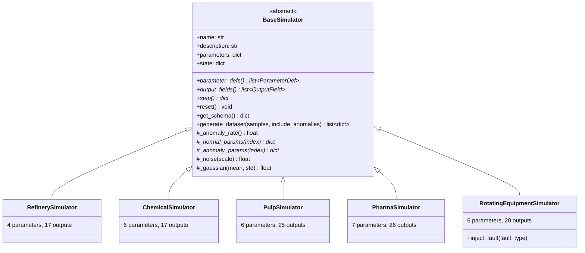
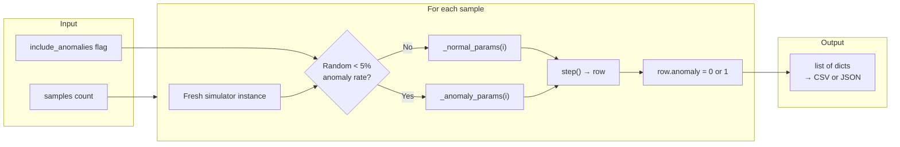

# Simulators

Five physics-based industrial process simulators generate realistic time-series data for AI/ML training. Each simulator exists in two identical implementations — Python ([`backend/app/simulators/`](../backend/app/simulators/)) for server-side execution and TypeScript ([`frontend/src/simulators/`](../frontend/src/simulators/)) for client-side browser execution.

## Class Hierarchy

> Full diagram source: [diagrams/simulator-class-hierarchy.mermaid](diagrams/simulator-class-hierarchy.mermaid)

## Base Simulator Contract

Every simulator inherits from [`BaseSimulator`](../backend/app/simulators/base.py) and implements:

| Method | Purpose |
|--------|---------|
| `parameter_defs()` | Returns list of `ParameterDef(name, min_val, max_val, default, unit)` |
| `output_fields()` | Returns list of `OutputField(name, unit, description)` |
| `step()` | Advances one time step, returns a dict of output field values |
| `_normal_params(index)` | Generates randomized parameters within normal operating range |
| `_anomaly_params(index)` | Generates parameters that produce anomalous readings |

The base class provides:
- `generate_dataset(samples, include_anomalies)` — bulk data generation with ~5% anomaly rate
- `_noise(scale)` / `_gaussian(mean, std)` — noise injection using Box-Muller transform
- `get_schema()` — serializes parameter defs and output fields for the API

---

## 1. Refinery — Crude Oil Atmospheric Distillation

Simulates a crude oil atmospheric distillation column that separates crude into gasoline, diesel, jet fuel, and residual fractions.

**Source:** [`backend/app/simulators/refinery.py`](../backend/app/simulators/refinery.py) | [`frontend/src/simulators/refinery.ts`](../frontend/src/simulators/refinery.ts)

### Parameters (4)

| Name | Range | Default | Unit | Description |
|------|-------|---------|------|-------------|
| `crudeTemp` | 320–500 | 370 | °C | Crude oil input temperature |
| `pressure` | 12–20 | 15 | bar | Column pressure |
| `feedRate` | 80–160 | 120 | bbl/hr | Crude feed rate |
| `catalystActivity` | 0–1 | 0.85 | — | Catalyst effectiveness |

### Output Fields (17)

| Field | Unit | Description |
|-------|------|-------------|
| `timestamp` | step | Time step counter |
| `crudeInput` | bbl/hr | Actual feed rate with noise |
| `temperature` | °C | Column temperature |
| `pressure` | bar | Operating pressure |
| `gasolineYield` | % | Gasoline fraction yield |
| `dieselYield` | % | Diesel fraction yield |
| `jetFuelYield` | % | Jet fuel fraction yield |
| `residualYield` | % | Residual fraction yield |
| `gasolineOctane` | — | Gasoline octane number |
| `dieselCetane` | — | Diesel cetane number |
| `sulfurContent` | ppm | Sulfur in product |
| `efficiency` | % | Thermal efficiency |
| `yieldEfficiency` | % | Overall yield efficiency |
| `energyConsumption` | kWh | Energy per step |
| `energyIntensity` | kWh/bbl | Energy per barrel |
| `catalystLevel` | — | Remaining catalyst activity |
| `totalProcessed` | bbl | Cumulative barrels processed |

### Physics Model
- Temperature-pressure relationship optimizes yield distribution
- Catalyst activity degrades over time (tracked in state)
- Gaussian noise on temperature, pressure, and yields
- Yield fractions sum-constrained with residual as remainder

---

## 2. Chemical Reactor — Continuous Stirred-Tank Reactor (CSTR)

Simulates a CSTR where two reactants combine in the presence of a catalyst under controlled temperature, pressure, and mixing.

**Source:** [`backend/app/simulators/chemical.py`](../backend/app/simulators/chemical.py) | [`frontend/src/simulators/chemical.ts`](../frontend/src/simulators/chemical.ts)

### Parameters (6)

| Name | Range | Default | Unit | Description |
|------|-------|---------|------|-------------|
| `reactantA` | 80–180 | 100 | mol/L | Concentration of reactant A |
| `reactantB` | 80–180 | 120 | mol/L | Concentration of reactant B |
| `temperature` | 320–400 | 350 | °C | Reactor temperature |
| `pressure` | 15–35 | 25 | bar | Reactor pressure |
| `catalystConc` | 0–2 | 1.0 | mol/L | Catalyst concentration |
| `stirringSpeed` | 150–500 | 300 | RPM | Impeller speed |

### Output Fields (17)

| Field | Unit | Description |
|-------|------|-------------|
| `timestamp` | step | Time step counter |
| `temperature` | °C | Reactor temperature |
| `pressure` | bar | Operating pressure |
| `stirringSpeed` | RPM | Actual stirring speed |
| `pH` | — | Reactor pH |
| `reactantAConc` | mol/L | Remaining reactant A |
| `reactantBConc` | mol/L | Remaining reactant B |
| `productConc` | mol/L | Product concentration |
| `byproductConc` | mol/L | Byproduct concentration |
| `conversion` | % | Reactant conversion rate |
| `selectivity` | % | Product selectivity |
| `yield` | % | Overall yield |
| `spaceTimeYield` | mol/L·hr | Productivity metric |
| `catalystActivity` | — | Current catalyst effectiveness |
| `heatGeneration` | kW | Exothermic heat output |
| `massBalance` | — | Mass balance check (≈1.0) |
| `mixingEfficiency` | % | Mixing quality |

### Physics Model
- Arrhenius activation energy kinetics for reaction rate
- Mixing efficiency depends on stirring speed (diminishing returns above ~400 RPM)
- Catalyst deactivation over time
- pH drifts based on conversion and byproduct formation
- Mass balance tracked as validation metric

---

## 3. Pulp & Paper — Kraft Digester

Simulates a Kraft pulping process where wood chips are cooked in alkaline liquor to dissolve lignin and extract cellulose fibers.

**Source:** [`backend/app/simulators/pulp.py`](../backend/app/simulators/pulp.py) | [`frontend/src/simulators/pulp.ts`](../frontend/src/simulators/pulp.ts)

### Parameters (6)

| Name | Range | Default | Unit | Description |
|------|-------|---------|------|-------------|
| `woodInput` | 35–70 | 50 | tons/hr | Wood chip feed rate |
| `alkaliConc` | 6–14 | 10 | % | Alkali (NaOH) concentration |
| `temperature` | 145–185 | 170 | °C | Cooking temperature |
| `pressure` | 5–11 | 8 | bar | Digester pressure |
| `cookingTime` | 120–240 | 180 | min | Cook duration |
| `whiteChipRatio` | 0.85–1.0 | 0.92 | — | Fraction of quality chips |

### Output Fields (25)

| Field | Unit | Description |
|-------|------|-------------|
| `timestamp` | step | Time step counter |
| `woodChipInput` | tons/hr | Actual feed rate |
| `alkaliConcentration` | % | Effective alkali |
| `temperature` | °C | Digester temperature |
| `pressure` | bar | Operating pressure |
| `pH` | — | Liquor pH |
| `pulpYield` | % | Pulp yield from wood |
| `blackLiquor` | L/hr | Black liquor output |
| `blackLiquorSolids` | % | Solids in black liquor |
| `kappaNumber` | — | Lignin content indicator |
| `brightness` | % ISO | Pulp brightness |
| `ligninContent` | % | Residual lignin |
| `fiberLength` | mm | Average fiber length |
| `fiberStrength` | kN/m | Fiber tensile strength |
| `tearStrength` | mN·m²/g | Tear resistance |
| `burstStrength` | kPa·m²/g | Burst resistance |
| `viscosity` | mL/g | Pulp viscosity |
| `hFactor` | — | H-factor (time-temp integral) |
| `delignification` | % | Lignin removal percentage |
| `efficiency` | % | Process efficiency |
| `alkaliConsumption` | kg/ton | Alkali used per ton |
| `steamConsumption` | kg/ton | Steam used per ton |
| `chemicalEfficiency` | % | Chemical utilization |
| `totalWoodProcessed` | tons | Cumulative wood input |
| `totalPulpProduced` | tons | Cumulative pulp output |

### Physics Model
- **H-factor model** — integrates temperature over time using Arrhenius equation to predict delignification
- Activation energy: ~134 kJ/mol for lignin degradation
- Kappa number decreases with H-factor (higher = more lignin removed)
- Fiber properties correlate with kappa number and cooking severity
- Alkali consumption proportional to delignification rate

---

## 4. Pharmaceutical — GMP Batch Reactor

Simulates a Good Manufacturing Practice (GMP) compliant pharmaceutical batch reactor producing an Active Pharmaceutical Ingredient (API).

**Source:** [`backend/app/simulators/pharma.py`](../backend/app/simulators/pharma.py) | [`frontend/src/simulators/pharma.ts`](../frontend/src/simulators/pharma.ts)

### Parameters (7)

| Name | Range | Default | Unit | Description |
|------|-------|---------|------|-------------|
| `apiConc` | 80–130 | 100 | g/L | Target API concentration |
| `solventVol` | 300–700 | 500 | L | Solvent volume |
| `temperature` | 35–60 | 45 | °C | Reaction temperature |
| `stirringSpeed` | 200–450 | 350 | RPM | Impeller speed |
| `reactionTime` | 120–360 | 240 | min | Total reaction time |
| `catalystAmount` | 1–4 | 2.5 | g | Catalyst mass |
| `pH` | 5.5–8.5 | 7.0 | — | Target pH |

### Output Fields (26)

| Field | Unit | Description |
|-------|------|-------------|
| `timestamp` | step | Time step counter |
| `batchNumber` | — | Current batch identifier |
| `temperature` | °C | Reactor temperature |
| `pH` | — | Measured pH |
| `stirringSpeed` | RPM | Actual speed |
| `dissolvedOxygen` | mg/L | DO level |
| `pressure` | bar | Reactor pressure |
| `apiConcentration` | g/L | Current API concentration |
| `productConc` | g/L | Product concentration |
| `impurityLevel` | % | Impurity percentage |
| `purity` | % | Product purity |
| `assay` | % | Assay result |
| `yield` | % | Batch yield |
| `relatedSubstances` | % | Related substance content |
| `residualSolvents` | ppm | Residual solvent level |
| `heavyMetals` | ppm | Heavy metal content |
| `moisture` | % | Moisture content |
| `particleSize` | μm | Mean particle diameter |
| `opticalRotation` | ° | Optical rotation |
| `meltingPoint` | °C | Melting point |
| `batchProgress` | % | Completion percentage |
| `conversion` | % | Reactant conversion |
| `energyConsumption` | kWh | Energy used |
| `qcPassed` | bool | Quality control pass/fail |
| `cppStatus` | string | Critical Process Parameter status |
| `gmpCompliant` | bool | GMP compliance flag |

### Physics Model
- Kinetic rate constants for API synthesis
- **GMP CQA limits** enforced: purity ≥ 98%, impurity ≤ 0.5%, residual solvents ≤ 5000 ppm
- Temperature-pH optimization curve (optimal near 45°C, pH 7.0)
- Batch progress tracked as fraction of `reactionTime`
- `qcPassed` and `gmpCompliant` derived from CQA limit checks

---

## 5. Rotating Equipment — Predictive Maintenance

Simulates rotating machinery (pump/compressor) with fault injection for predictive maintenance model training. Unique among simulators in supporting runtime fault injection.

**Source:** [`backend/app/simulators/rotating.py`](../backend/app/simulators/rotating.py) | [`frontend/src/simulators/rotating.ts`](../frontend/src/simulators/rotating.ts)

### Parameters (6)

| Name | Range | Default | Unit | Description |
|------|-------|---------|------|-------------|
| `nominalRPM` | 3000–4000 | 3600 | RPM | Nominal rotation speed |
| `loadPercent` | 40–95 | 75 | % | Mechanical load |
| `ambientTemp` | 20–50 | 25 | °C | Ambient temperature |
| `bearingAge` | 0–1 | 0.1 | — | Bearing wear (0 = new, 1 = end-of-life) |
| `alignmentOffset` | 0–0.2 | 0.02 | mm | Shaft misalignment |
| `balanceGrade` | 0.5–8 | 2.5 | ISO G | Rotor balance grade |

### Output Fields (20)

| Field | Unit | Description |
|-------|------|-------------|
| `timestamp` | step | Time step counter |
| `rpm` | RPM | Actual rotation speed |
| `vibrationX` | mm/s | X-axis vibration velocity |
| `vibrationY` | mm/s | Y-axis vibration velocity |
| `vibrationZ` | mm/s | Z-axis vibration velocity |
| `vibrationOverall` | mm/s | RMS vibration magnitude |
| `bearingTemp` | °C | Bearing temperature |
| `motorCurrent` | A | Motor current draw |
| `dischargePressure` | bar | Discharge pressure |
| `wpdBand1Energy` | — | Wavelet packet band 1 energy |
| `wpdBand2Energy` | — | Wavelet packet band 2 energy |
| `wpdBand3Energy` | — | Wavelet packet band 3 energy |
| `wpdBand4Energy` | — | Wavelet packet band 4 energy |
| `wpdBand5Energy` | — | Wavelet packet band 5 energy |
| `loadPercent` | % | Current load |
| `ambientTemp` | °C | Ambient temperature |
| `faultType` | — | Active fault type or `no_fault` |
| `maintenanceRequired` | bool | Maintenance flag |
| `faultSeverity` | 0–1 | Fault severity (0 = none) |
| `runningHours` | hr | Cumulative operating hours |

### Fault Types

Faults are injected via `inject_fault(fault_type)` and progress over time:

| Fault | Vibration Signature | WPD Effect | Progression |
|-------|-------------------|------------|-------------|
| `bearing_fault` | High-frequency broadband | Band 4–5 energy spike | Accelerating (bearing degradation) |
| `rotor_imbalance` | 1× RPM dominant | Band 1–2 energy increase | Linear |
| `misalignment` | 2× RPM + axial | Band 2–3 energy increase | Linear |
| `no_fault` | Baseline noise | Normal distribution | — |

### Physics Model
- **Wavelet Packet Decomposition (WPD)** — 5 frequency bands model spectral energy distribution
- Each fault type has a distinct spectral signature (used for ML classification)
- Fault severity progresses with each step (rate depends on fault type)
- Bearing temperature rises with severity and load
- `maintenanceRequired` triggers when severity exceeds threshold

---

## Dataset Generation

All simulators support bulk dataset generation via `generate_dataset(samples, include_anomalies)`:

Each sample creates a fresh simulator instance with randomized parameters to produce independent, identically distributed rows. The `anomaly` column (0 or 1) serves as a label for supervised ML training.

## Related Documentation

- [API Reference](API_REFERENCE.md) — endpoints for simulation control and dataset download
- [Data Model](DATA_MODEL.md) — TypeScript and Pydantic type definitions
- [Architecture](ARCHITECTURE.md) — how simulators fit into the system
